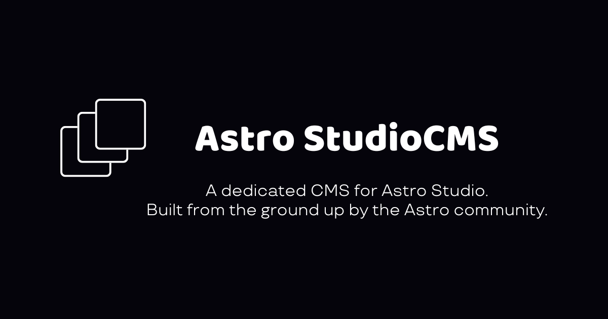

# Astro Studio CMS

This is an SSR CMS built with AstroDB / Lucia Auth / Unpic Image handler for the Astro Ecosystem.

To see how to get started, check out the [studioCMS README](./packages/studioCMS/README.md).

> [!IMPORTANT]
> This project is still in early development and it is not yet ready for production use. The package hasn't been published yet. If you encounter any issues or have ideas for new features, please let us know by [opening an issue](https://github.com/astrolicious/studiocms/issues/new/choose) on our GitHub repository.

## Contributing

We welcome contributions from the community! Whether it's bug reports, feature requests, or code contributions, we appreciate your help in making this project better.

### Bug Reports and Feature Requests

If you encounter any bugs or have ideas for new features, please open an issue on our [GitHub repository](https://github.com/astrolicious/studiocms). When creating a new issue, please provide as much detail as possible, including steps to reproduce the issue (for bugs) and a clear description of the proposed feature.

### Code Contributions

If you'd like to contribute code to this project, please follow these steps:

1. Fork the repository and create a new branch for your contribution.
2. Make your changes and ensure that the code follows our coding conventions and style guidelines.
3. Write tests for your changes, if applicable.
4. Update the documentation, if necessary.
5. Commit your changes and push them to your forked repository.
6. Open a pull request against the main repository, providing a clear description of your changes and their purpose.

We will review your contribution as soon as possible and provide feedback or merge it into the main codebase if everything looks good.

Please note that by contributing to this project, you agree to our [Code of Conduct](https://github.com/astrolicious/.github/blob/main/.github/CODE_OF_CONDUCT.md).

Thank you for your interest in contributing to this project!

## Chat with Us

We have an active community of developers on the Astrolicious [Discord Server](https://chat.astrolicious.dev/). Feel free to join and connect with other contributors, ask questions, or discuss ideas related to this project or other Astrolicious projects.

## Our ToolSet

- **Node** - 20.12.x
- **pnpm** - 8.15.4
- [`BiomeJS`](https://biomejs.dev/) - 1.7.3
- [`Moon`](https://moonrepo.dev) - 1.24.3
- [`Proto`](https://moonrepo.dev) - 0.34.4

## This is a [`Moonrepo`](https://moonrepo.dev)

Follow install instructions listed on Moonrepo's docs, and you'll be all set to go! Its even a super easy single line command you put in your terminal!

To use the dev server the command is `moon run playground:dev`

> Note: You can always fallback to standard pnpm, Please ensure your version matches our project, and run `pnpm i --frozen-lockfile` to install deps

## How to use the playgrounds

At the moment these are the current steps for setting up the main studioCMS playground.

This is intended for testing and development, since we have not yet released a package to play with use these instruction _at your own risk_ This project is still very experimental

The primary playground is the [Node Playground](./playgrounds/node/)

Steps to get a running playground should be the following:

- clone repo
- run `pnpm i --frozen-lockfile`
- change line 14 of the [node playground's](./playgrounds/node/astro.config.mjs#L14) config to `true`
- read the first time setup instructions listed in the [main package readme](./packages/studioCMS/README.md#first-start-and-setup) then replace the astro db commands with the following:

  Commands to run:

  - `pnpm playground:login` - Login your CLI to Astro Studio
  - `pnpm playground:link` - Link to Astro Studio and Create a new DB for your CMS Installation
  - `pnpm playground:push` - Creates the base tables on the remote database.
  - `pnpm playground:dev` - Starts the Dev server connected to the linked database

Once that process completes successfuly you are ready to navigate to http://localhost:4321/start and follow the instructions to get started.

It will redirect and ask you to shutdown and change the above mentioned config option `dbStartPage` to `false` at which point that will enable full functionality of the CMS. you can now restart the dev server with `astro dev --remote` to continue viewing your new site!

That will give you a running dev environment of what i work with daily... the only other thing to get the full functionality currently is to configure a gitub oAuth app for the [Dashboard and authentication](./packages/studioCMS/README.md#authentication)

To start the playground again use the command `pnpm playground:dev`

## Licensing

[MIT Licensed](./LICENSE).
